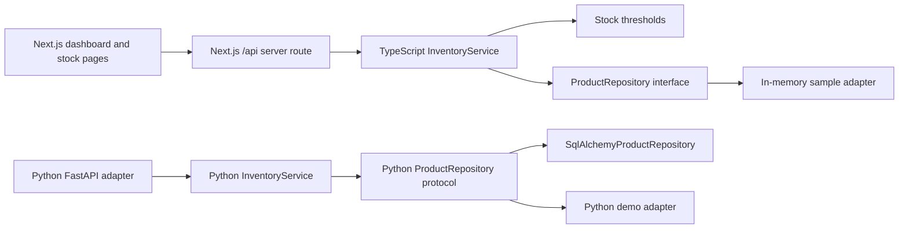

# FranquiYA — project learning guide

> **In one sentence:** FranquiYA is a portfolio prototype for franchise operations; its inventory demo now runs on fictional data through a read-only, hexagonal slice.

![[FranquiYA Architecture.svg]]

## What a presenter can show

1. Open the login page and choose **Explore demo**. No demo password is displayed.
2. The dashboard loads sample inventory counts and stock alerts from the API.
3. Open Stock, search and filter products, sort them, and export a CSV that spreadsheet apps can open.
4. Explain that sample values are fictional and that demo sessions cannot write to the API.

The in-memory demo catalog has six generic sample items. At the time of verification, it returned six products, two low-stock products, two critical-stock products, and zero pending invoices. These are fixed demo values, not business results.

## Architecture in the code



| Hexagonal role | Code | Responsibility |
|---|---|---|
| Hosted demo domain, application and repository port | `frontend/src/server/demo-inventory.ts` | Applies stock thresholds and reads fictional sample products through a repository interface |
| Hosted HTTP adapter | `frontend/src/app/api/[...path]/route.ts` | Serves the demo login, stock, alerts and dashboard endpoints on the Vercel host |
| Domain | `backend/domain/inventory.py` | Product value and critical/low/healthy thresholds |
| Application | `backend/application/inventory_service.py` | List, fetch, update and alert use cases |
| Outbound port | `backend/application/ports.py` | Repository contract used by the service |
| SQL adapter | `backend/adapters/outbound/sqlalchemy_product_repository.py` | Converts persisted rows to domain products |
| Demo adapter | `backend/adapters/outbound/demo_inventory_repository.py` | Returns fictional in-memory products; refuses updates |
| Inbound adapter | `backend/routers/stock.py` | Keeps the existing `/api/stock` HTTP contract |
| Composition | `backend/adapters/inbound/fastapi_dependencies.py` | Selects SQL for normal users and sample memory data for the demo identity |

The hosted demo route issues a time-limited demo marker and rejects every write method. The marker is not a private credential: all hosted demo values are fictional and public. The local Python API has a signed demo claim, rejects write requests for that identity, requires `JWT_SECRET` in production, and skips development seed records. Both implementations currently cover inventory; other API areas keep their earlier persistence pattern.

## Product and UX choices

- A one-click demo removes the fragile public-password workflow.
- A persistent demo banner says the records are samples and the session is read-only.
- Demo navigation exposes only Dashboard and Stock. Chat and create-product actions are hidden.
- Alerts are driven by domain thresholds: stock at or below zero is critical; positive stock at or below the minimum is low.
- The stock export is CSV. Excel and other spreadsheet programs can open it without bundling the unmaintained `xlsx` package.

## Run it locally

The hosted demo API and frontend run together. For the Python API implementation, use a separate terminal:

```powershell
cd franquiYA/backend
python -m venv .venv
.venv\Scripts\pip install -r requirements.txt
$env:JWT_SECRET = 'replace-with-a-random-local-secret'
$env:DEMO_MODE_ENABLED = 'true'
.venv\Scripts\uvicorn main:app --reload --host 127.0.0.1 --port 8000
```

Start the frontend:

```powershell
cd franquiYA/frontend
npm ci
npm run dev
```

Visit `http://localhost:3000`, then choose **Explore demo**. The Next.js server routes implement the read-only sample-data API. The Python backend can run separately for work on its wider API.

## Verification performed

- Backend: **35 tests passed**. New coverage checks stock thresholds, the service through a fake repository, demo login, sample stock and dashboard totals, write rejection, demo-disabled behavior, and that regular users still use SQL when demo mode is enabled.
- Frontend: **14 Jest tests passed**.
- Frontend: Next.js **15.5.27 production build passed** after a clean `npm ci`.
- `npm audit --omit=dev` reports **0 production dependency vulnerabilities** after pinning production PostCSS and moving the animation helper to development dependencies. The full development/build dependency tree still reports 35 high advisories; this is not a claim that all dependencies are clean.
- HTTP smoke check through Next.js server routes: demo login returned a token; stock returned six products; dashboard totals matched; a demo stock update returned 403.
- Browser automation was unavailable in this environment, so the interactive UI was not verified in an automated browser.

## Presentation-video review

The earlier portfolio review of the local 50-second presentation video found a consistent visual style and fast feature overview. It also found a visible demo credential, business-like values without a sample-data label, and precise quality claims not substantiated by the repository. **The video file itself has not been regenerated by this code change.** Before presenting or publishing that clip, edit out the credential, identify sample data, and remove or verify each numerical claim. Replace a static feature sequence with the demo flow above so viewers can see an action and result.

This review is based on the earlier inspection of local portfolio video files; it is not a fresh review of a live deployment. The repository still supports describing FranquiYA as a portfolio prototype, not as a deployed or adopted business system.

## UADE connection

[[Clase 6 17-09-2026]] covers keeping system diagrams aligned with code and testing modules separately. This inventory slice applies that principle: stock rules are tested without HTTP or SQL, and a repository contract allows both SQL and demo data adapters. The class note is a learning connection; it does not document this project.

## Evidence and limits

- Code and test results come from the public [FranquiYA repository](https://github.com/nachopalmeri/FranquiYA).
- The demo frontend and API are deployed together on Vercel at [franqui-ya.vercel.app](https://franqui-ya.vercel.app); the verified deployment ran commit `675973f`. The new same-origin server route has built and passed local HTTP smoke checks; its deployment is pending.
- The repository includes an optional Render Blueprint for the separate full Python API. It is not required by the hosted synthetic-data demo.
- No real customer, staff usage, financial result, performance result, or production reliability has been established.
- Other API domains are not yet hexagonal and are not enabled in the demo navigation.
- Confirm personal ownership of particular features before making a first-person contribution claim.
