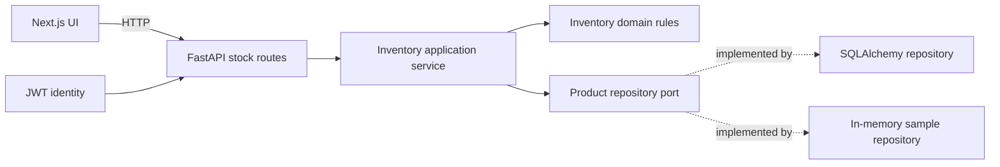

# FranquiYA

FranquiYA is a portfolio prototype for franchise operations. The inventory demo is functional and uses clearly labelled fictional sample data. This repository does not establish real business use or measured business impact.

## What works in the presentation demo

- One-click demo entry; no shared demo password is shown.
- Dashboard counts, stock list, search, filters, sorting, alerts, and CSV export.
- Demo sessions are short-lived and read-only at the API boundary.
- The sample inventory lives in memory and never writes to the application database.

The demo currently covers the dashboard and inventory slice. Other business areas remain outside the demo workflow and retain their existing implementation.

## Hexagonal inventory slice



The application service depends on the repository interface. The SQLAlchemy adapter maps database rows into domain products; the demo adapter returns fictional products. FastAPI is the driving adapter. The existing `/api/stock` paths and response fields remain compatible.

## Run locally

Start the backend in one terminal:

```powershell
cd franquiYA/backend
python -m venv .venv
.venv\Scripts\pip install -r requirements.txt
$env:JWT_SECRET = 'replace-with-a-long-random-secret'
$env:DEMO_MODE_ENABLED = 'true'
.venv\Scripts\uvicorn main:app --reload --host 127.0.0.1 --port 8000
```

Start the frontend in a second terminal:

```powershell
cd franquiYA/frontend
npm ci
npm run dev
```

Open `http://localhost:3000` and choose **Explore demo**. For a remote backend, set `FRANQUIYA_API_URL` to its origin before starting/building Next.js. The frontend proxies `/api/*` to that backend.

Set `DEMO_MODE_ENABLED=false` to disable demo sessions. Always use a unique random `JWT_SECRET` outside local development. In Render, configure the secret as `JWT_SECRET` (the application reads that name).

## Deploy the demo

The root `render.yaml` is a Blueprint for a free Render API service. It uses fictional in-memory inventory in the demo and does not provision a paid database. Free services can spin down while idle.

1. Create a Render Blueprint from this repository and deploy `render.yaml`.
2. Import the repository into Vercel with project root `franquiYA/frontend`.
3. In Vercel Preview and Production settings, set `FRANQUIYA_API_URL` to the Render service origin (for example, `https://franquiya-api.onrender.com`).
4. Deploy the frontend and open **Explore demo**. The frontend proxies `/api/*` to the configured API origin.

Provider projects and credentials must exist before these steps can produce a live deployment. No hosted deployment is currently verified.

## Tests and security

Backend tests:

```powershell
cd franquiYA/backend
.venv\Scripts\python.exe -m pytest -q
```

Frontend tests and production build:

```powershell
cd franquiYA/frontend
npm test -- --runInBand
npm run build
```

`npm audit --omit=dev` reports zero production dependency vulnerabilities. The full development/build dependency audit still has 35 high advisories. The inventory exporter uses CSV, which Excel can open, instead of the unmaintained `xlsx` package.

## Repository status

Portfolio project / internal operations prototype. The hexagonal architecture currently covers inventory only; the other routers still use their existing persistence patterns.
