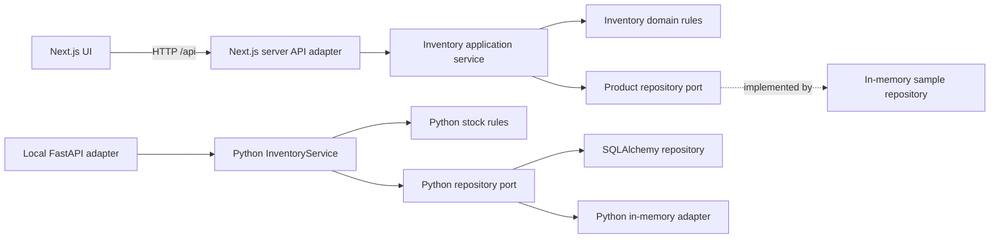

# FranquiYA

FranquiYA is a portfolio prototype for franchise operations. The inventory demo is functional and uses clearly labelled fictional sample data. This repository does not establish real business use or measured business impact.

## What works in the presentation demo

- The login page offers an optional short dashboard preview; its older figures are labelled illustrative.
- One-click demo entry; no shared demo password is shown.
- Dashboard counts, stock list, search, filters, sorting, alerts, and CSV export.
- Demo access uses public fictional data; write requests are rejected at the API boundary.
- The sample inventory lives in memory and never writes to the application database.

The demo currently covers the dashboard and inventory slice. Other business areas remain outside the demo workflow and retain their existing implementation.

## Hexagonal inventory slice



The deployed demo uses a same-origin Next.js server API adapter, so it needs no separate backend host or CORS setup. Its application service depends on a repository interface and returns fictional, in-memory products. The local FastAPI backend has its own Python implementation of the inventory slice and keeps the same `/api/stock` contract.

## Run locally

The read-only presentation demo needs only the frontend:

```powershell
cd franquiYA/frontend
npm ci
npm run dev
```

Open `http://localhost:3000` and choose **Explore demo**. The frontend's `/api/*` server routes provide the read-only demo without a separate API process. Run the Python backend separately when working on its full API.

For the Python API, start a separate terminal:

```powershell
cd franquiYA/backend
python -m venv .venv
.venv\Scripts\pip install -r requirements.txt
$env:JWT_SECRET = 'replace-with-a-long-random-secret'
$env:DEMO_MODE_ENABLED = 'true'
.venv\Scripts\uvicorn main:app --reload --host 127.0.0.1 --port 8000
```

Set `DEMO_MODE_ENABLED=false` to disable demo sessions. Always use a unique random `JWT_SECRET` outside local development. In Render, configure the secret as `JWT_SECRET` (the application reads that name).

## Deploy the demo

The demo UI and API run together on Vercel at the existing `franqui-ya.vercel.app` production domain. The root `render.yaml` remains an optional Blueprint for a separate Python API service; it is not required by the hosted read-only demo. Free Render services can spin down while idle.

1. Keep the Vercel project root at `franquiYA/frontend`.
2. Push to `main`; the connected Vercel project builds and deploys the frontend and its `/api/*` server routes together.
3. Open **Explore demo**. No separate API URL or CORS configuration is needed.

The full database-backed API is still a separate service and is not used by this synthetic-data demo.

## Tests and security

Backend tests:

```powershell
cd franquiYA/backend
.venv\Scripts\python.exe -m pytest -q
```

Frontend tests and production build:

```powershell
cd franquiYA/frontend
npm test -- --runInBand
npm run build
```

`npm audit --omit=dev` reports zero production dependency vulnerabilities. The full development/build dependency audit still has 35 high advisories. The inventory exporter uses CSV, which Excel can open, instead of the unmaintained `xlsx` package.

## Repository status

Portfolio project / internal operations prototype. The hexagonal architecture currently covers inventory only; the other routers still use their existing persistence patterns.
